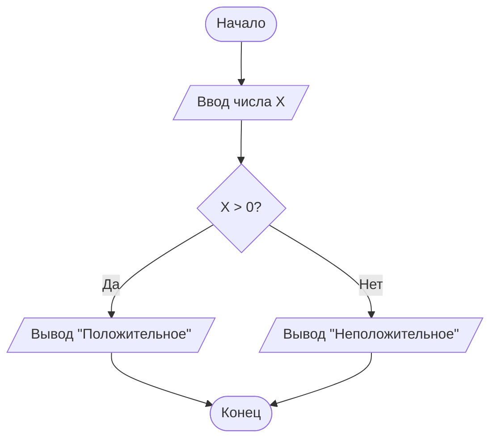

<p align="center">
Кафедра АСУ<br>
ОТЧЕТ по лабораторной работе № 3<br>
<br>
По теме: Диаграмма как код<br>
<br>
По дисциплине «Основы современных цифровых технологий и искусственного интеллекта»<br>
<br>
Выполнил: студент гр. ИВТ-ИСУ-103Б Халилов Ильсур Сабирович<br>
<br>
Проверил: профессор каф. АСУ Арьков В.Ю.<br>
<br>
Уфа 2025
</p>
<br><br>
<br><br>
<br><br>

**Алгоритм**.
<br><br>

Изучил в википедии историю происхождения слова **Алгоритм**.
<br><br>
<kbd>
Около 825 г. н.э. персидский учёный и эрудит Мухаммад ибн Муса аль-Хорезми написал «Китаб аль-хисаб аль-хинди» («Книга индийских вычислений») и «Китаб аль-джам' валь-тафрик аль-хисаб аль-хинди» («Сложение и вычитание в индийской арифметике»). В начале XII века появились латинские переводы этих текстов, включающие индуистско-арабскую систему счисления и арифметику , например, «Liber Alghoarismi de practica arismetrice» , приписываемый Иоанну Севильскому , и «Liber Algorismi de numero Indorum» , приписываемый Аделару Батскому . [ 10 ] Здесь «alghoarismi» или «algorismi» — это латинизация имени аль-Хорезми; [ 1 ] Текст начинается с фразы Dixit Algorismi , или «Так говорил Аль-Хорезми». [ 2 ]
В английском языке слово «алгоризм» стало означать использование позиционной системы счисления в вычислениях; оно встречается в « Ancrene Wisse» примерно 1225 года. [ 11 ] К тому времени, когда Джеффри Чосер написал «Кентерберийские рассказы» в конце XIV века, он использовал вариант того же слова для описания аугримных камней , камней, используемых для позиционных вычислений. [ 12 ] [ 13 ] В XV веке, под влиянием греческого слова ἀριθμός ( arithmos , «число»; ср. «арифметика»), латинское слово было изменено на algorithmus . [ 14 ] К 1596 году эта форма слова использовалась в английском языке как algorithm Томасом Худом . [ 15 ]

<br><br>

**Блок-схемы**.
<br><br>

Посмотрел статью Блок=схема на википедии.
<br><br>
<kbd>
Блок-схема — распространённый тип схем (графических моделей), описывающих алгоритмы или процессы, в которых отдельные шаги изображаются в виде блоков различной формы, соединённых между собой линиями, указывающими направление последовательности.
Основные элементы схем алгоритма
При начертании элементов рекомендуется придерживаться строгих размеров, определяемых двумя значениями a и b. Значение a выбирается из ряда 15, 20, 25.. мм, b рассчитывается из соотношения 2⋅a = 3⋅b. Определение размеров несёт рекомендательный характер, однако, при соблюдении выполнения размеров блок-схемы имеют более аккуратный вид.

<br><br>
 Выяснил с помощью интеллектуального
помощника perplexity, когда «блок-схемы алгоритмов» стали называть
«схемы алгоритмов» и почему: 
<br><br>
<kbd>
Переход от «блок-схемы алгоритмов» к упрощённому «схемы алгоритмов» произошёл в русскоязычной технической литературе и образовании примерно в 1990-х–2000-х годах. Термин «блок-схема» стандартизирован ГОСТ 19.701-90 (с 1990 г.), но в школьных учебниках и вузах стали чаще использовать «схема алгоритма» для упрощения, поскольку полное название подчёркивает графическую структуру (блоки + стрелки), а «схема» стало общим синонимом.
<br><br>
 
 **Отечественный стандарт
по рисованию схемы алгоритма**
<br><br>
<kbd>
ГОСТ 19.701-90 — основной отечественный стандарт по схемам алгоритмов: «Единая система программной документации. Схемы алгоритмов, программ, данных и систем. Обозначения условные и правила выполнения». Введён 01.01.1992, заменяет ГОСТ 19.002-80 и 19.003-80, соответствует ISO 5807-85.

<br><br>

Выяснил с помощью интеллектуального помощника perplexity, что такое Workflow Diagram и есть ли здесь какая-то связь
со схемой алгоритма Flowchart
<br><br>

<kbd>
 
Workflow Diagram
Workflow Diagram (диаграмма рабочего процесса) — визуальное представление бизнес-процесса или последовательности задач в организации, часто с использованием flowchart-символов для шагов, решений и потоков. Это более широкий инструмент для mapping процессов в проектах, чем чисто технические схемы.
 
<br><br>
 
Связь с Flowchart
Flowchart (блок-схема алгоритма) — это подвид или базовый инструмент для Workflow Diagram: flowchart фокусируется на линейных шагах и решениях (прямоугольники, ромбы), а workflow diagram расширяет его на сложные бизнес-процессы с несколькими участниками. По ГОСТ 19.701-90 flowchart = схема алгоритма с унифицированными символами.

</kbd>

| Аспект     | Flowchart beslick+1​  | Workflow Diagram beslick+1​   |
| ---------- | --------------------- | ----------------------------- |
| Фокус      | Логика алгоритма, код | Бизнес-процессы, роли, задачи |
| Сложность  | Простая, линейная     | Многоуровневая, с ветвлениями |
| Символы    | Стандарт (овал, ромб) | Расширенные + swimlanes       |
| Применение | Программирование      | Управление проектами, BPM     |
 
<br><br>

 Запустил сервис Draw.io 
 
 <br><br>
 
 

 <br>
  Выяснил, что означает английское слово
Terminator (Терминатор), его происхождение, и какое отношение
всё это имеет к рисованию схемы алгоритма и к фильмам с уча
стием Шварценеггера
<br><br>

<kbd>
 Слово Terminator в английском происходит из латыни (terminator — «тот, кто устанавливает границу»), с 1734 года обозначало линию раздела света и тени на планете или Луне (от terminus — «конец, предел»). С 1844 года — общее значение «тот, кто завершает».​

Terminator в схемах алгоритмов
В flowchart (блок-схеме по ГОСТ 19.701-90) это овал — символ начала («Start») или конца («End») алгоритма, также называемый «терминатор» за роль «завершителя» процесса. В стандарте — обязательный элемент: алгоритм всегда начинается и заканчивается овалом.​

Связь с фильмами Шварценеггера
Фильм «The Terminator» (1984) с Арнольдом Шварценеггером взял название из sci-fi-контекста, где терминатор — машина-убийца, «завершающая» цель. 

</kbd>


<br>​<br>

Блок-схема в формате XML-файла:

<br>​<br>

```xml
<?xml version="1.0" encoding="UTF-8"?>
<mxfile host="app.diagrams.net" agent="Mozilla/5.0 (Windows NT 10.0; Win64; x64) AppleWebKit/537.36 (KHTML, like Gecko) Chrome/143.0.0.0 Safari/537.36" version="29.2.7" pages="2">
<diagram name="Страница-1" id="0b838_rSexJzskzePHsn">
<mxGraphModel dx="512" dy="622" grid="1" gridSize="10" guides="1" tooltips="1" connect="1" arrows="1" fold="1" page="1" pageScale="1" pageWidth="827" pageHeight="1169" math="0" shadow="0">
<root>
<mxCell id="0" />
<mxCell id="1" parent="0" />
<mxCell id="eV_ToHxFh29TrGhIpu3h-5" edge="1" parent="1" source="eV_ToHxFh29TrGhIpu3h-2" style="edgeStyle=none;curved=1;rounded=0;orthogonalLoop=1;jettySize=auto;html=1;exitX=0.5;exitY=1;exitDx=0;exitDy=0;exitPerimeter=0;entryX=0.5;entryY=0;entryDx=0;entryDy=0;fontSize=12;startSize=8;endSize=8;" target="eV_ToHxFh29TrGhIpu3h-4">
<mxGeometry relative="1" as="geometry" />
</mxCell>
<mxCell id="eV_ToHxFh29TrGhIpu3h-2" parent="1" style="strokeWidth=2;html=1;shape=mxgraph.flowchart.terminator;whiteSpace=wrap;" value="" vertex="1">
<mxGeometry height="60" width="100" x="220" y="280" as="geometry" />
</mxCell>
<mxCell id="eV_ToHxFh29TrGhIpu3h-3" parent="1" style="strokeWidth=2;html=1;shape=mxgraph.flowchart.terminator;whiteSpace=wrap;" value="" vertex="1">
<mxGeometry height="60" width="100" x="220" y="460" as="geometry" />
</mxCell>
<mxCell id="eV_ToHxFh29TrGhIpu3h-4" parent="1" style="shape=parallelogram;html=1;strokeWidth=2;perimeter=parallelogramPerimeter;whiteSpace=wrap;rounded=1;arcSize=12;size=0.23;" value="" vertex="1">
<mxGeometry height="60" width="100" x="220" y="370" as="geometry" />
</mxCell>
<mxCell id="eV_ToHxFh29TrGhIpu3h-6" edge="1" parent="1" source="eV_ToHxFh29TrGhIpu3h-4" style="edgeStyle=none;curved=1;rounded=0;orthogonalLoop=1;jettySize=auto;html=1;exitX=0.5;exitY=1;exitDx=0;exitDy=0;entryX=0.5;entryY=0;entryDx=0;entryDy=0;entryPerimeter=0;fontSize=12;startSize=8;endSize=8;" target="eV_ToHxFh29TrGhIpu3h-3">
<mxGeometry relative="1" as="geometry" />
</mxCell>
</root>
</mxGraphModel>
</diagram>
<diagram id="Xheu7nJxYjXQ1vJpWgG7" name="Страница-2">
<mxGraphModel dx="512" dy="622" grid="0" gridSize="10" guides="1" tooltips="1" connect="1" arrows="1" fold="1" page="0" pageScale="1" pageWidth="827" pageHeight="1169" math="0" shadow="0">
<root>
<mxCell id="0" />
<mxCell id="1" parent="0" />
</root>
</mxGraphModel>
</diagram>
</mxfile>
```

<br>​<br>

Блок-схема в формате PNG-файла:

<br>​<br>


<br>​<br>

Блок-схема в формате SWG-файла:

<br>​<br>


<br><br>

Сохранил диаграмму из mermaid в формате PNG

[](https://mermaid.live/edit#pako:eNpVkT9PwzAQxb-KdRNIaRWT_x6QaApdimDoRNLBaq5x1MaOHEelJPnuOKkQYN3gu_d774br4aAKBAbHs7ocBNeG7Na5JPY9ZanQVWtq3u7JYvE4bNCQWkm8DmR1t1GkFappKlne3_jVBJG0304YEiMqeRpvUjr73yQOZJ1teWNUs_-r7C5qIM9Z9S5s_H9FaLSul-zI2ZEvDlyTlOsZAQdKXRXAjO7QgRp1zacW-knNwQisMQdmvwXXpxxyOVpPw-WHUvWPTauuFGCzz63tuqbgBtcVLzX_RVAWqFPVSQMs9OcIYD18AqNRsAxiP_aSJKLU9WLPgasdu_7ygdLAj9wgsZXQ0YGveau7DKkXhT5NktiNwzCMHcCiMkq_3g4x32P8BomEfH4)

<br><br>

Сохранил диаграмму в формате SVG

<br><br>


Копировал схему в буфер обмена и вставил в Word:


<br><br>

Затем вставил в Paint:


<br><br>

Вставил в Google Colab MD ссылку:


Вставка диаграммы в файл MD


<br><br>


<br><br>

Ссылка для вывода моей диаграммы 


<br><br> 

base64 в википедии 

<br><br>

<kbd>
Base64 — стандарт кодирования двоичных данных при помощи только 64 символов ASCII. Алфавит кодирования содержит латинские символы A-Z, a-z, цифры 0-9 (всего 62 знака) и 2 дополнительных символа, зависящих от системы реализации. Каждые 3 исходных байта кодируются четырьмя символами (увеличение на ¹⁄₃).

Эта система широко используется в электронной почте для представления бинарных файлов в тексте письма (транспортное кодирование).
</kbd>

<br><br>

Вставил в VSCode код диаграммы:


<br><br>

Запустил контейнер в Docker


<br><br>

Посмотрел статью Mind map на википедии:


<br><br>

Посмотрел статью PlantUML на википедии:


<br><br>

PlantUML поддерживают не только отдельные программы, но и много платформ/сервисов.

## IDE и редакторы кода
- IntelliJ IDEA / PyCharm / WebStorm через плагины PlantUML.  
- Visual Studio Code (расширение “PlantUML”).  
- Atom / Sublime Text через соответствующие плагины.

## Веб‑платформы и онлайн‑редакторы
- Официальный PlantUML Web Server и онлайн‑редактор PlantText.  
- Miro (онлайн‑доска) имеет встроенный редактор диаграмм из PlantUML‑кода.  
- Confluence, DokuWiki, MediaWiki через плагины для вики‑страниц.

## Инструменты документации и прочее
- Doxygen (генерация диаграмм из кода).  
- Различные CI/док‑генераторы, которые рендерят `.puml` в PNG/SVG и встраивают в HTML/Markdown‑документацию.


